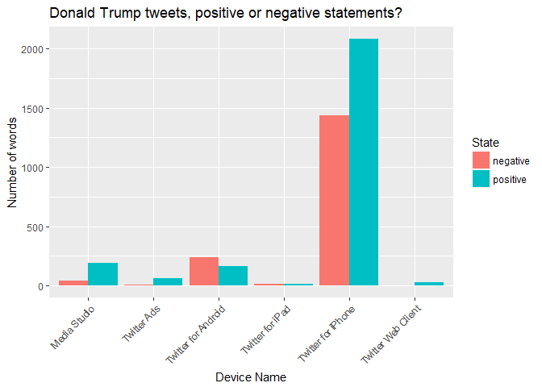
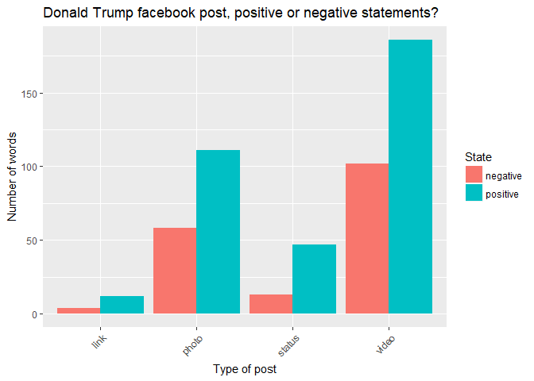
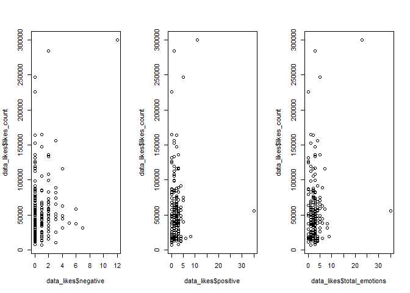

Assignment 5: Working with APIs
================
Michal Heydel
05/11/2017

Instructions
------------

This file (`Assignment-5.Rmd`) is an RMarkdown file, which is slightly different from a Jupyter notebook. You will need to open it within [RStudio](https://www.rstudio.com), and compile it to a Markdown file using the **knitr** package. From RStudio, this is the "Knit" button that appears in the top edge of your Source pane. When you knit it, `R` will execute the code in your code blocks, and render the output as formatted Markdown (in this example it will `generate Assignment-5.md`).

There are plenty of instructions about how to use RMarkdown, such as [these](http://rmarkdown.rstudio.com/authoring_rcodechunks.html). If you define a code block using Python, then any code within that block will be executed in Python. It works with [other languages](http://rmarkdown.rstudio.com/authoring_knitr_engines.html) too.

#### Deadline: Wednesday 5pm, 8 November

Part A: Working with APIs (20 points)
-------------------------------------

1.  Try using `curl` to get a website from `http://www.example.com`. This one is provided for you, as an example. On Windows, you might need to change the language engine to something other than bash. (See <http://rmarkdown.rstudio.com/authoring_knitr_engines.html#bash>)

``` r
# I have done it also in command Prompt in Windows
library(curl)
readLines(curl("http://www.example.com"))
```

    ##  [1] "<!doctype html>"                                                                                      
    ##  [2] "<html>"                                                                                               
    ##  [3] "<head>"                                                                                               
    ##  [4] "    <title>Example Domain</title>"                                                                    
    ##  [5] ""                                                                                                     
    ##  [6] "    <meta charset=\"utf-8\" />"                                                                       
    ##  [7] "    <meta http-equiv=\"Content-type\" content=\"text/html; charset=utf-8\" />"                        
    ##  [8] "    <meta name=\"viewport\" content=\"width=device-width, initial-scale=1\" />"                       
    ##  [9] "    <style type=\"text/css\">"                                                                        
    ## [10] "    body {"                                                                                           
    ## [11] "        background-color: #f0f0f2;"                                                                   
    ## [12] "        margin: 0;"                                                                                   
    ## [13] "        padding: 0;"                                                                                  
    ## [14] "        font-family: \"Open Sans\", \"Helvetica Neue\", Helvetica, Arial, sans-serif;"                
    ## [15] "        "                                                                                             
    ## [16] "    }"                                                                                                
    ## [17] "    div {"                                                                                            
    ## [18] "        width: 600px;"                                                                                
    ## [19] "        margin: 5em auto;"                                                                            
    ## [20] "        padding: 50px;"                                                                               
    ## [21] "        background-color: #fff;"                                                                      
    ## [22] "        border-radius: 1em;"                                                                          
    ## [23] "    }"                                                                                                
    ## [24] "    a:link, a:visited {"                                                                              
    ## [25] "        color: #38488f;"                                                                              
    ## [26] "        text-decoration: none;"                                                                       
    ## [27] "    }"                                                                                                
    ## [28] "    @media (max-width: 700px) {"                                                                      
    ## [29] "        body {"                                                                                       
    ## [30] "            background-color: #fff;"                                                                  
    ## [31] "        }"                                                                                            
    ## [32] "        div {"                                                                                        
    ## [33] "            width: auto;"                                                                             
    ## [34] "            margin: 0 auto;"                                                                          
    ## [35] "            border-radius: 0;"                                                                        
    ## [36] "            padding: 1em;"                                                                            
    ## [37] "        }"                                                                                            
    ## [38] "    }"                                                                                                
    ## [39] "    </style>    "                                                                                     
    ## [40] "</head>"                                                                                              
    ## [41] ""                                                                                                     
    ## [42] "<body>"                                                                                               
    ## [43] "<div>"                                                                                                
    ## [44] "    <h1>Example Domain</h1>"                                                                          
    ## [45] "    <p>This domain is established to be used for illustrative examples in documents. You may use this"
    ## [46] "    domain in examples without prior coordination or asking for permission.</p>"                      
    ## [47] "    <p><a href=\"http://www.iana.org/domains/example\">More information...</a></p>"                   
    ## [48] "</div>"                                                                                               
    ## [49] "</body>"                                                                                              
    ## [50] "</html>"

1.  Get the information from the [GitHub API](https://developer.github.com/v3/repos/#get) about the [`lse-st445/lectures`](https://github.com/lse-st445/lectures) repository. You will need to use `curl` for this, but you are welcome to use the [**RCurl**](https://cran.r-project.org/web/packages/RCurl/index.html) package for R, or the [PycURL](http://pycurl.io/docs/latest/) module for Python to do this. The examples below give you the starter code you need for the R solution.

    Hint: Part of the URL will be `repos/lse-st445`.

``` r
readLines(curl("https://api.github.com/repos/lse-st445/lectures"))
```

    ## Warning in readLines(curl("https://api.github.com/repos/lse-st445/
    ## lectures")): incomplete final line found on 'https://api.github.com/repos/
    ## lse-st445/lectures'

    ## [1] "{\"id\":102475502,\"name\":\"lectures\",\"full_name\":\"lse-st445/lectures\",\"owner\":{\"login\":\"lse-st445\",\"id\":31655282,\"avatar_url\":\"https://avatars0.githubusercontent.com/u/31655282?v=4\",\"gravatar_id\":\"\",\"url\":\"https://api.github.com/users/lse-st445\",\"html_url\":\"https://github.com/lse-st445\",\"followers_url\":\"https://api.github.com/users/lse-st445/followers\",\"following_url\":\"https://api.github.com/users/lse-st445/following{/other_user}\",\"gists_url\":\"https://api.github.com/users/lse-st445/gists{/gist_id}\",\"starred_url\":\"https://api.github.com/users/lse-st445/starred{/owner}{/repo}\",\"subscriptions_url\":\"https://api.github.com/users/lse-st445/subscriptions\",\"organizations_url\":\"https://api.github.com/users/lse-st445/orgs\",\"repos_url\":\"https://api.github.com/users/lse-st445/repos\",\"events_url\":\"https://api.github.com/users/lse-st445/events{/privacy}\",\"received_events_url\":\"https://api.github.com/users/lse-st445/received_events\",\"type\":\"Organization\",\"site_admin\":false},\"private\":false,\"html_url\":\"https://github.com/lse-st445/lectures\",\"description\":\"ST445 Managing and Visualizing Data\",\"fork\":false,\"url\":\"https://api.github.com/repos/lse-st445/lectures\",\"forks_url\":\"https://api.github.com/repos/lse-st445/lectures/forks\",\"keys_url\":\"https://api.github.com/repos/lse-st445/lectures/keys{/key_id}\",\"collaborators_url\":\"https://api.github.com/repos/lse-st445/lectures/collaborators{/collaborator}\",\"teams_url\":\"https://api.github.com/repos/lse-st445/lectures/teams\",\"hooks_url\":\"https://api.github.com/repos/lse-st445/lectures/hooks\",\"issue_events_url\":\"https://api.github.com/repos/lse-st445/lectures/issues/events{/number}\",\"events_url\":\"https://api.github.com/repos/lse-st445/lectures/events\",\"assignees_url\":\"https://api.github.com/repos/lse-st445/lectures/assignees{/user}\",\"branches_url\":\"https://api.github.com/repos/lse-st445/lectures/branches{/branch}\",\"tags_url\":\"https://api.github.com/repos/lse-st445/lectures/tags\",\"blobs_url\":\"https://api.github.com/repos/lse-st445/lectures/git/blobs{/sha}\",\"git_tags_url\":\"https://api.github.com/repos/lse-st445/lectures/git/tags{/sha}\",\"git_refs_url\":\"https://api.github.com/repos/lse-st445/lectures/git/refs{/sha}\",\"trees_url\":\"https://api.github.com/repos/lse-st445/lectures/git/trees{/sha}\",\"statuses_url\":\"https://api.github.com/repos/lse-st445/lectures/statuses/{sha}\",\"languages_url\":\"https://api.github.com/repos/lse-st445/lectures/languages\",\"stargazers_url\":\"https://api.github.com/repos/lse-st445/lectures/stargazers\",\"contributors_url\":\"https://api.github.com/repos/lse-st445/lectures/contributors\",\"subscribers_url\":\"https://api.github.com/repos/lse-st445/lectures/subscribers\",\"subscription_url\":\"https://api.github.com/repos/lse-st445/lectures/subscription\",\"commits_url\":\"https://api.github.com/repos/lse-st445/lectures/commits{/sha}\",\"git_commits_url\":\"https://api.github.com/repos/lse-st445/lectures/git/commits{/sha}\",\"comments_url\":\"https://api.github.com/repos/lse-st445/lectures/comments{/number}\",\"issue_comment_url\":\"https://api.github.com/repos/lse-st445/lectures/issues/comments{/number}\",\"contents_url\":\"https://api.github.com/repos/lse-st445/lectures/contents/{+path}\",\"compare_url\":\"https://api.github.com/repos/lse-st445/lectures/compare/{base}...{head}\",\"merges_url\":\"https://api.github.com/repos/lse-st445/lectures/merges\",\"archive_url\":\"https://api.github.com/repos/lse-st445/lectures/{archive_format}{/ref}\",\"downloads_url\":\"https://api.github.com/repos/lse-st445/lectures/downloads\",\"issues_url\":\"https://api.github.com/repos/lse-st445/lectures/issues{/number}\",\"pulls_url\":\"https://api.github.com/repos/lse-st445/lectures/pulls{/number}\",\"milestones_url\":\"https://api.github.com/repos/lse-st445/lectures/milestones{/number}\",\"notifications_url\":\"https://api.github.com/repos/lse-st445/lectures/notifications{?since,all,participating}\",\"labels_url\":\"https://api.github.com/repos/lse-st445/lectures/labels{/name}\",\"releases_url\":\"https://api.github.com/repos/lse-st445/lectures/releases{/id}\",\"deployments_url\":\"https://api.github.com/repos/lse-st445/lectures/deployments\",\"created_at\":\"2017-09-05T11:56:33Z\",\"updated_at\":\"2017-10-12T05:25:05Z\",\"pushed_at\":\"2017-11-07T15:58:38Z\",\"git_url\":\"git://github.com/lse-st445/lectures.git\",\"ssh_url\":\"git@github.com:lse-st445/lectures.git\",\"clone_url\":\"https://github.com/lse-st445/lectures.git\",\"svn_url\":\"https://github.com/lse-st445/lectures\",\"homepage\":\"\",\"size\":25719,\"stargazers_count\":6,\"watchers_count\":6,\"language\":\"Jupyter Notebook\",\"has_issues\":true,\"has_projects\":true,\"has_downloads\":true,\"has_wiki\":true,\"has_pages\":false,\"forks_count\":18,\"mirror_url\":null,\"archived\":false,\"open_issues_count\":2,\"forks\":18,\"open_issues\":2,\"watchers\":6,\"default_branch\":\"master\",\"organization\":{\"login\":\"lse-st445\",\"id\":31655282,\"avatar_url\":\"https://avatars0.githubusercontent.com/u/31655282?v=4\",\"gravatar_id\":\"\",\"url\":\"https://api.github.com/users/lse-st445\",\"html_url\":\"https://github.com/lse-st445\",\"followers_url\":\"https://api.github.com/users/lse-st445/followers\",\"following_url\":\"https://api.github.com/users/lse-st445/following{/other_user}\",\"gists_url\":\"https://api.github.com/users/lse-st445/gists{/gist_id}\",\"starred_url\":\"https://api.github.com/users/lse-st445/starred{/owner}{/repo}\",\"subscriptions_url\":\"https://api.github.com/users/lse-st445/subscriptions\",\"organizations_url\":\"https://api.github.com/users/lse-st445/orgs\",\"repos_url\":\"https://api.github.com/users/lse-st445/repos\",\"events_url\":\"https://api.github.com/users/lse-st445/events{/privacy}\",\"received_events_url\":\"https://api.github.com/users/lse-st445/received_events\",\"type\":\"Organization\",\"site_admin\":false},\"network_count\":18,\"subscribers_count\":3}"

``` r
# INPUT:
# C:\Users\Michal>curl https://api.github.com/repos/lse-st445/lectures
#
#  OUTPUT:
# {
#   "id": 102475502,
#   "name": "lectures",
#   "full_name": "lse-st445/lectures",
#   "owner": {
#     "login": "lse-st445",
#     "id": 31655282,
#     "avatar_url": "https://avatars0.githubusercontent.com/u/31655282?v=4",
#     "gravatar_id": "",
#     "url": "https://api.github.com/users/lse-st445",
#     "html_url": "https://github.com/lse-st445",
#     "followers_url": "https://api.github.com/users/lse-st445/followers",
#     "following_url": "https://api.github.com/users/lse-st445/following{/other_user}",
#     "gists_url": "https://api.github.com/users/lse-st445/gists{/gist_id}",
#     "starred_url": "https://api.github.com/users/lse-st445/starred{/owner}{/repo}",
#     "subscriptions_url": "https://api.github.com/users/lse-st445/subscriptions",
#     "organizations_url": "https://api.github.com/users/lse-st445/orgs",
#     "repos_url": "https://api.github.com/users/lse-st445/repos",
#     "events_url": "https://api.github.com/users/lse-st445/events{/privacy}",
#     "received_events_url": "https://api.github.com/users/lse-st445/received_events",
#     "type": "Organization",
#     "site_admin": false
#   },
#   "private": false,
#   "html_url": "https://github.com/lse-st445/lectures",
#   "description": "ST445 Managing and Visualizing Data",
#   "fork": false,
#   "url": "https://api.github.com/repos/lse-st445/lectures",
#   "forks_url": "https://api.github.com/repos/lse-st445/lectures/forks",
#   "keys_url": "https://api.github.com/repos/lse-st445/lectures/keys{/key_id}",
#   "collaborators_url": "https://api.github.com/repos/lse-st445/lectures/collaborators{/collaborator}",
#   "teams_url": "https://api.github.com/repos/lse-st445/lectures/teams",
#   "hooks_url": "https://api.github.com/repos/lse-st445/lectures/hooks",
#   "issue_events_url": "https://api.github.com/repos/lse-st445/lectures/issues/events{/number}",
#   "events_url": "https://api.github.com/repos/lse-st445/lectures/events",
#   "assignees_url": "https://api.github.com/repos/lse-st445/lectures/assignees{/user}",
#   "branches_url": "https://api.github.com/repos/lse-st445/lectures/branches{/branch}",
#   "tags_url": "https://api.github.com/repos/lse-st445/lectures/tags",
#   "blobs_url": "https://api.github.com/repos/lse-st445/lectures/git/blobs{/sha}",
#   "git_tags_url": "https://api.github.com/repos/lse-st445/lectures/git/tags{/sha}",
#   "git_refs_url": "https://api.github.com/repos/lse-st445/lectures/git/refs{/sha}",
#   "trees_url": "https://api.github.com/repos/lse-st445/lectures/git/trees{/sha}",
#   "statuses_url": "https://api.github.com/repos/lse-st445/lectures/statuses/{sha}",
#   "languages_url": "https://api.github.com/repos/lse-st445/lectures/languages",
#   "stargazers_url": "https://api.github.com/repos/lse-st445/lectures/stargazers",
#   "contributors_url": "https://api.github.com/repos/lse-st445/lectures/contributors",
#   "subscribers_url": "https://api.github.com/repos/lse-st445/lectures/subscribers",
#   "subscription_url": "https://api.github.com/repos/lse-st445/lectures/subscription",
#   "commits_url": "https://api.github.com/repos/lse-st445/lectures/commits{/sha}",
#   "git_commits_url": "https://api.github.com/repos/lse-st445/lectures/git/commits{/sha}",
#   "comments_url": "https://api.github.com/repos/lse-st445/lectures/comments{/number}",
#   "issue_comment_url": "https://api.github.com/repos/lse-st445/lectures/issues/comments{/number}",
#   "contents_url": "https://api.github.com/repos/lse-st445/lectures/contents/{+path}",
#   "compare_url": "https://api.github.com/repos/lse-st445/lectures/compare/{base}...{head}",
#   "merges_url": "https://api.github.com/repos/lse-st445/lectures/merges",
#   "archive_url": "https://api.github.com/repos/lse-st445/lectures/{archive_format}{/ref}",
#   "downloads_url": "https://api.github.com/repos/lse-st445/lectures/downloads",
#   "issues_url": "https://api.github.com/repos/lse-st445/lectures/issues{/number}",
#   "pulls_url": "https://api.github.com/repos/lse-st445/lectures/pulls{/number}",
#   "milestones_url": "https://api.github.com/repos/lse-st445/lectures/milestones{/number}",
#   "notifications_url": "https://api.github.com/repos/lse-st445/lectures/notifications{?since,all,participating}",
#   "labels_url": "https://api.github.com/repos/lse-st445/lectures/labels{/name}",
#   "releases_url": "https://api.github.com/repos/lse-st445/lectures/releases{/id}",
#   "deployments_url": "https://api.github.com/repos/lse-st445/lectures/deployments",
#   "created_at": "2017-09-05T11:56:33Z",
#   "updated_at": "2017-10-12T05:25:05Z",
#   "pushed_at": "2017-10-26T07:07:52Z",
#   "git_url": "git://github.com/lse-st445/lectures.git",
#   "ssh_url": "git@github.com:lse-st445/lectures.git",
#   "clone_url": "https://github.com/lse-st445/lectures.git",
#   "svn_url": "https://github.com/lse-st445/lectures",
#   "homepage": "",
#   "size": 19960,
#   "stargazers_count": 6,
#   "watchers_count": 6,
#   "language": "Jupyter Notebook",
#   "has_issues": true,
#   "has_projects": true,
#   "has_downloads": true,
#   "has_wiki": true,
#   "has_pages": false,
#   "forks_count": 18,
#   "mirror_url": null,
#   "archived": false,
#   "open_issues_count": 1,
#   "forks": 18,
#   "open_issues": 1,
#   "watchers": 6,
#   "default_branch": "master",
#   "organization": {
#     "login": "lse-st445",
#     "id": 31655282,
#     "avatar_url": "https://avatars0.githubusercontent.com/u/31655282?v=4",
#     "gravatar_id": "",
#     "url": "https://api.github.com/users/lse-st445",
#     "html_url": "https://github.com/lse-st445",
#     "followers_url": "https://api.github.com/users/lse-st445/followers",
#     "following_url": "https://api.github.com/users/lse-st445/following{/other_user}",
#     "gists_url": "https://api.github.com/users/lse-st445/gists{/gist_id}",
#     "starred_url": "https://api.github.com/users/lse-st445/starred{/owner}{/repo}",
#     "subscriptions_url": "https://api.github.com/users/lse-st445/subscriptions",
#     "organizations_url": "https://api.github.com/users/lse-st445/orgs",
#     "repos_url": "https://api.github.com/users/lse-st445/repos",
#     "events_url": "https://api.github.com/users/lse-st445/events{/privacy}",
#     "received_events_url": "https://api.github.com/users/lse-st445/received_events",
#     "type": "Organization",
#     "site_admin": false
#   },
#   "network_count": 18,
#   "subscribers_count": 3
# }
```

Part B: Working with Twitter Data (50 points)
---------------------------------------------

1.  Use the **twitteR** package for R to look up the last 2,000 Tweets from [Donald Trump's Twitter feed](https://twitter.com/realDonaldTrump). Save the output to an object called `trump_tweets`, as a data.frame.

    (Note that in the code block, you will need to change the `eval = FALSE` to `eval = TRUE`.)

``` r
suppressPackageStartupMessages(library(twitteR))
# replace with your credentials
api_key <- "OWea1JDj2RMgv9ktXcKkM3CRI"
api_secret <- "zolroSpEUpqFrTABaVHttXDYrKAIWBBGPpFjXZ5j4r201obVWq"
access_token <- "927171157018759173-tqtWOcZMkWsnCvUToWsR3W0qSp64jwm"
access_token_secret <- "qMvXFuUpsnZD3b2TB1O49aGLSU6p607hDBnzkaYCdJWxR"
    
# authorize the Twitter access
setup_twitter_oauth(api_key, api_secret, access_token, access_token_secret)
```

    ## [1] "Using direct authentication"

``` r
# use userTimeline()
tw <- userTimeline("realDonaldTrump", n = 2000, includeRts = TRUE)

# use the command from lecture notes to convert result into a data.frame
twDf <- twListToDF(tw)
```

1.  Display the output of the first 20 Tweets. What sort of returned information is in the result?

``` r
suppressPackageStartupMessages(library(stringi))
suppressPackageStartupMessages(library(stringr))
#twDf[["text"]] <- stri_enc_toascii(twDf[["text"]])
twDf[1:20, ]
```

    ##                                                                                                                                                                                                                                                                                                                                                                                                                                                                                                                                                                                                                                                                                                                                                                                                                           text
    ## 1                                                                                                                                                                                                                                                                                                                                                                                                                                                                                                                                                                                                                                                                                                                  Franklin, such a great photo. \n\nHAPPY 99th BIRTHDAY to your father, @BillyGraham! https://t.co/l0c7RvvOa1
    ## 2                                                                                                                                                                                                                                                                                                                                                                                                                                                                                                                                                                                                                                                                                  .@EdWGillespie will totally turn around the high crime and poor economic performance of VA. MS-13 and crime will be gone. Vote today, ASAP!
    ## 3                                                                                                                                                                                                                                                                                                                                                                                                                                                                                                                                                                                                                                                                                                                                                     ....and has been horrible on Virginia economy. Vote @EdWGillespie today!
    ## 4                                                                                                                                                                                                                                                                                                                                                                                                                                                                                                                                                                                                                                                                                              Ralph Northam will allow crime to be rampant in Virginia. He<U+0092>s weak on crime, weak on our GREAT VETS, Anti-Second Amendment....
    ## 5                                                                                                                                                                                                                                                                                                                                                                                                                                                                                                                                                                                                                                                                                                                                       ....is making. Working very hard on TAX CUTS for the middle class, companies and jobs!
    ## 6                                                                                                                                                                                                                                                                                                                                                                                                                                                                                                                                                                                                                                                                                               Stock market hit yet another all-time record high yesterday. There is great confidence in the moves that my Administration....
    ## 7                                                                                                                                                                                                                                                                                                                                                                                                                                                                                                                                                                                                                                                                                       Thank you to President Moon of South Korea for the beautiful welcoming ceremony. It will always be remembered. https://t.co/bMvJz1iV2a
    ## 8                                                                                                                                                                                                                                                                                                                                                                                                                                                                                                                     It was my great honor to have lunch with our INCREDIBLE U.S. and ROK troops at Camp Humphreys, in South Korea. <ed><U+00A0><U+00BC><ed><U+00B7><U+00BA><ed><U+00A0><U+00BC><ed><U+00B7><U+00B8><ed><U+00A0><U+00BC><ed><U+00B7><U+00B0><ed><U+00A0><U+00BC><ed><U+00B7><U+00B7><U+0085> https://t.co/QJtVR498yK
    ## 9  RT @AbeShinzo: <U+30C8><U+30E9><U+30F3><U+30D7><U+5927><U+7D71><U+9818><U+306B><U+3088><U+308B><U+3001><U+521D><U+306E><U+3001><U+6B74><U+53F2><U+7684><U+306A><U+65E5><U+672C><U+8A2A><U+554F><U+306F><U+3001><U+9593><U+9055><U+3044><U+306A><U+304F><U+3001><U+65E5><U+7C73><U+540C><U+76DF><U+306E><U+63FA><U+308B><U+304E><U+306A><U+3044><U+7D46><U+3092><U+4E16><U+754C><U+306B><U+793A><U+3059><U+3053><U+3068><U+304C><U+3067><U+304D><U+307E><U+3057><U+305F><U+3002>\n\n<U+672C><U+5F53><U+306B><U+3042><U+308A><U+304C><U+3068><U+3046><U+3001><U+30C9><U+30CA><U+30EB><U+30C9><U+3002><U+305D><U+3057><U+3066><U+3001><U+30A2><U+30B8><U+30A2><U+6B74><U+8A2A><U+306E><U+5927><U+6210><U+529F><U+3092><U+304A><U+7948><U+308A><U+3057><U+3066><U+3044><U+307E><U+3059><U+3002>\n\n@realDonaldTrump https://t.<U+0085>
    ## 10                                                                                                                                                                                                                                                                                                                                                                                                                                                                                                                                                                                                                                                                                                                                    ....Some of those they are harshly treating have been <U+0093>milking<U+0094> their country for years!
    ## 11                                                                                                                                                                                                                                                                                                                                                                                                                                                                                                                                                                                                                                                                                                      I have great confidence in King Salman and the Crown Prince of Saudi Arabia, they know exactly what they are doing....
    ## 12                                                                                                                                                                                                                                                                                                                                                                                                                                                                                                                                                                                                                                                                                                       Getting ready to leave for South Korea and meetings with President Moon, a fine gentleman. We will figure it all out!
    ## 13                                                                                                                                                                                                                                                                                                                                                                                                                                                                                                                                                                                                                                                                            My visit to Japan and friendship with PM Abe will yield many benefits, for our great Country. Massive military &amp; energy orders happening+++!
    ## 14                                                                                                                                                                                                                                                                                                                                                                                                                                                                                                                                                                                                                                                                                        The state of Virginia economy, under Democrat rule, has been terrible. If you vote Ed Gillespie tomorrow, it will come roaring back!
    ## 15                                                                                                                                                                                                                                                                                                                                                                                                                                                                                                                                                                                                                         #USA<ed><U+00A0><U+00BC><ed><U+00B7><U+00BA><ed><U+00A0><U+00BC><ed><U+00B7><U+00B8> #Japan<ed><U+00A0><U+00BC><ed><U+00B7><U+00AF><ed><U+00A0><U+00BC><ed><U+00B7><U+00B5> https://t.co/EvxFqAVnFS
    ## 16                                                                                                                                                                                                                                                                                                                                                                                                                                                                                                                                                                                                                                                                                ...Americans do what we do best: we pull together. We join hands. We lock arms and through the tears and the sadnes<U+0085> https://t.co/CTtTeWjVHX
    ## 17                                                                                                                                                                                                                                                                                                                                                                                                                                                                                                                                                                                                                                                                            May God be w/ the people of Sutherland Springs, Texas. The FBI &amp; law enforcement are on the scene. I am monitoring the situation from Japan.
    ## 18                                                                                                                                                                                                                                                                                                                                                                                                                                                                                                                                                                                                                                                                                                         Heading into the 12 days with great negotiating strength because of our tremendous economy. https://t.co/4HnXkR3EhW
    ## 19                                                                                                                                                                                                                                                                                                                                                                                                                                                                                                                                                                                                                                                                                                                         It was a true honor to be at Yokota Air Base with our GREAT @USForcesJapan! https://t.co/KEXnIkkQks
    ## 20                                                                                                                                                                                                                                                                                                                                                                                                                                                                                                                                                                                                                                                                                                                    Playing golf with Prime Minister Abe and Hideki Matsuyama, two wonderful people! https://t.co/vYLULe0o2K
    ##    favorited favoriteCount       replyToSN             created truncated
    ## 1      FALSE         37528            <NA> 2017-11-07 14:30:54     FALSE
    ## 2      FALSE         40233            <NA> 2017-11-07 10:56:55     FALSE
    ## 3      FALSE         25628 realDonaldTrump 2017-11-07 10:53:19     FALSE
    ## 4      FALSE         35854            <NA> 2017-11-07 10:53:04     FALSE
    ## 5      FALSE         32172 realDonaldTrump 2017-11-07 10:37:30     FALSE
    ## 6      FALSE         44642            <NA> 2017-11-07 10:37:01     FALSE
    ## 7      FALSE         49280            <NA> 2017-11-07 10:25:31     FALSE
    ## 8      FALSE         40868            <NA> 2017-11-07 07:39:54      TRUE
    ## 9      FALSE             0            <NA> 2017-11-07 01:53:41     FALSE
    ## 10     FALSE         70097 realDonaldTrump 2017-11-06 23:05:14     FALSE
    ## 11     FALSE        112056            <NA> 2017-11-06 23:03:35     FALSE
    ## 12     FALSE         70124            <NA> 2017-11-06 21:28:20     FALSE
    ## 13     FALSE         60954            <NA> 2017-11-06 21:15:32     FALSE
    ## 14     FALSE         72854            <NA> 2017-11-06 21:12:15     FALSE
    ## 15     FALSE         66493            <NA> 2017-11-06 13:09:30     FALSE
    ## 16     FALSE         80967            <NA> 2017-11-06 04:48:25      TRUE
    ## 17     FALSE        184271            <NA> 2017-11-05 20:06:34     FALSE
    ## 18     FALSE         56385            <NA> 2017-11-05 07:37:08     FALSE
    ## 19     FALSE         53636            <NA> 2017-11-05 07:28:31     FALSE
    ## 20     FALSE        104309            <NA> 2017-11-05 06:25:16     FALSE
    ##            replyToSID                 id replyToUID
    ## 1                <NA> 927906208203276288       <NA>
    ## 2                <NA> 927852358209622016       <NA>
    ## 3  927851387857367040 927851452185407490   25073877
    ## 4                <NA> 927851387857367040       <NA>
    ## 5  927847349648609280 927847471321141249   25073877
    ## 6                <NA> 927847349648609280       <NA>
    ## 7                <NA> 927844454957850625       <NA>
    ## 8                <NA> 927802776737984513       <NA>
    ## 9                <NA> 927715648477724672       <NA>
    ## 10 927672843504177152 927673257230327808   25073877
    ## 11               <NA> 927672843504177152       <NA>
    ## 12               <NA> 927648870796070912       <NA>
    ## 13               <NA> 927645648685551616       <NA>
    ## 14               <NA> 927644826006425601       <NA>
    ## 15               <NA> 927523335956848640       <NA>
    ## 16               <NA> 927397233741492225       <NA>
    ## 17               <NA> 927265906086031363       <NA>
    ## 18               <NA> 927077305876434945       <NA>
    ## 19               <NA> 927075137131896832       <NA>
    ## 20               <NA> 927059219370643456       <NA>
    ##                                                                          statusSource
    ## 1  <a href="http://twitter.com/download/iphone" rel="nofollow">Twitter for iPhone</a>
    ## 2  <a href="http://twitter.com/download/iphone" rel="nofollow">Twitter for iPhone</a>
    ## 3  <a href="http://twitter.com/download/iphone" rel="nofollow">Twitter for iPhone</a>
    ## 4  <a href="http://twitter.com/download/iphone" rel="nofollow">Twitter for iPhone</a>
    ## 5  <a href="http://twitter.com/download/iphone" rel="nofollow">Twitter for iPhone</a>
    ## 6  <a href="http://twitter.com/download/iphone" rel="nofollow">Twitter for iPhone</a>
    ## 7                <a href="https://studio.twitter.com" rel="nofollow">Media Studio</a>
    ## 8  <a href="http://twitter.com/download/iphone" rel="nofollow">Twitter for iPhone</a>
    ## 9  <a href="http://twitter.com/download/iphone" rel="nofollow">Twitter for iPhone</a>
    ## 10 <a href="http://twitter.com/download/iphone" rel="nofollow">Twitter for iPhone</a>
    ## 11 <a href="http://twitter.com/download/iphone" rel="nofollow">Twitter for iPhone</a>
    ## 12 <a href="http://twitter.com/download/iphone" rel="nofollow">Twitter for iPhone</a>
    ## 13 <a href="http://twitter.com/download/iphone" rel="nofollow">Twitter for iPhone</a>
    ## 14 <a href="http://twitter.com/download/iphone" rel="nofollow">Twitter for iPhone</a>
    ## 15 <a href="http://twitter.com/download/iphone" rel="nofollow">Twitter for iPhone</a>
    ## 16                 <a href="http://twitter.com" rel="nofollow">Twitter Web Client</a>
    ## 17 <a href="http://twitter.com/download/iphone" rel="nofollow">Twitter for iPhone</a>
    ## 18 <a href="http://twitter.com/download/iphone" rel="nofollow">Twitter for iPhone</a>
    ## 19                 <a href="http://twitter.com" rel="nofollow">Twitter Web Client</a>
    ## 20  <a href="http://twitter.com/#!/download/ipad" rel="nofollow">Twitter for iPad</a>
    ##         screenName retweetCount isRetweet retweeted longitude latitude
    ## 1  realDonaldTrump         7814     FALSE     FALSE        NA       NA
    ## 2  realDonaldTrump        10829     FALSE     FALSE        NA       NA
    ## 3  realDonaldTrump         1954     FALSE     FALSE        NA       NA
    ## 4  realDonaldTrump        10195     FALSE     FALSE        NA       NA
    ## 5  realDonaldTrump         5676     FALSE     FALSE        NA       NA
    ## 6  realDonaldTrump         8897     FALSE     FALSE        NA       NA
    ## 7  realDonaldTrump        15258     FALSE     FALSE        NA       NA
    ## 8  realDonaldTrump        10559     FALSE     FALSE        NA       NA
    ## 9  realDonaldTrump        21541      TRUE     FALSE        NA       NA
    ## 10 realDonaldTrump        43896     FALSE     FALSE        NA       NA
    ## 11 realDonaldTrump        78347     FALSE     FALSE        NA       NA
    ## 12 realDonaldTrump        12871     FALSE     FALSE        NA       NA
    ## 13 realDonaldTrump        14223     FALSE     FALSE        NA       NA
    ## 14 realDonaldTrump        19735     FALSE     FALSE        NA       NA
    ## 15 realDonaldTrump        16863     FALSE     FALSE        NA       NA
    ## 16 realDonaldTrump        17465     FALSE     FALSE        NA       NA
    ## 17 realDonaldTrump        40306     FALSE     FALSE        NA       NA
    ## 18 realDonaldTrump        12098     FALSE     FALSE        NA       NA
    ## 19 realDonaldTrump        11629     FALSE     FALSE        NA       NA
    ## 20 realDonaldTrump        23236     FALSE     FALSE        NA       NA

``` r
names(twDf) # text of the tweet, Have i favorite it, How many favorites, the location it was sent from, the device it was sent from and much more 
```

    ##  [1] "text"          "favorited"     "favoriteCount" "replyToSN"    
    ##  [5] "created"       "truncated"     "replyToSID"    "id"           
    ##  [9] "replyToUID"    "statusSource"  "screenName"    "retweetCount" 
    ## [13] "isRetweet"     "retweeted"     "longitude"     "latitude"

``` r
# https://developer.twitter.com/en/docs/tweets/data-dictionary/overview/tweet-object
```

1.  How could we convert the information about the device into a simpler variable, containing just the device?

``` r
suppressPackageStartupMessages(library(dplyr))
twDf$statusSource <- unlist(str_extract_all(twDf$statusSource, "(?<=>)(.*)(?=<)" ))

colnames(twDf)[10] = "device"
```

``` r
Source_DT <- table(twDf$device)
Source_DT
```

    ## 
    ##        Media Studio         Twitter Ads Twitter for Android 
    ##                 102                  33                 159 
    ##    Twitter for iPad  Twitter for iPhone  Twitter Web Client 
    ##                  18                1675                  13

1.  Use the **quanteda** package to save this to a corpus object, look up the result using the Lexicoder Sentiment dictionary (see \`?data\_dictionary\_LSD2015), and plot the positive versus negative balance using a barplot.

    ``` r
    suppressPackageStartupMessages(library("quanteda"))
    trump_corpus <- corpus(twDf)
    device = docvars(trump_corpus, "device") 
    trump_sentiment <- dfm(trump_corpus, groups = device, dictionary = data_dictionary_LSD2015[1:2])

    # plot a barplot of positive versus negative
    trump_sentiment   
    ```

        ## Document-feature matrix of: 6 documents, 2 features (0% sparse).
        ## 6 x 2 sparse Matrix of class "dfmSparse"
        ##                      features
        ## docs                  negative positive
        ##   Twitter for iPhone      1438     2084
        ##   Media Studio              38      191
        ##   Twitter Web Client         2       27
        ##   Twitter for iPad          11       16
        ##   Twitter Ads                4       61
        ##   Twitter for Android      238      166

``` r
library(ggplot2)
data_plot <- as.data.frame(trump_sentiment)
data_plot$device <- rownames(data_plot)
```

``` r
library(reshape2)

data_plot_long <- melt(data_plot, id.vars="device", variable.name="State" )

ggplot(data = data_plot_long, aes(x = device, y = value, fill = State) ) + 
  geom_bar(stat="identity", position = position_dodge()) +
  theme(axis.text.x = element_text(angle = 45, hjust = 1)) +
  labs(y = "Number of words", x = "Device Name") +
  ggtitle("Donald Trump tweets, positive or negative statements?")
```



Part C: Working with Facebook Data (30 points)
----------------------------------------------

1.  Access the last 20 Facebook posts from [Donald Trump's public page](https://www.facebook.com/DonaldTrump/). You can find starter code [here](https://github.com/kbenoit/ITAUR/blob/master/6_advanced/social_media_example.R), and you can use this to follow the examples.

``` r
suppressPackageStartupMessages(library(Rfacebook))
suppressPackageStartupMessages(library(quanteda))   
```

``` r
# Access token: https://developers.facebook.com/tools/explorer/
token <- "EAACEdEose0cBAGbYoMUZAij52MkZAbwz7OFEi7Ig7B9REiI0DwLgSED2NkLPJQWoXZBI4xp5NvGbZAHlAi50QFm0kFeeAj3Gb1Mksgeu6Y1k079HqU3JMQgQIwpeESv24ZC7A5hfZBhjy1iGfDsLxZAQQmZAlkFNJccvwMwwPrjj5DVhuZCGbDJhu6qqzPzkT8XztlxA4KZBx1BAZDZD"
    
# use getPage() here

Donald_Trump <- getPage('DonaldTrump', token = token, n = 200)
```

    ## 25 posts 50 posts 75 posts 100 posts 125 posts 150 posts 175 posts 200 posts

1.  Display the first 5 posts.

``` r
head(Donald_Trump,5)
```

    ##        from_id       from_name
    ## 1 153080620724 Donald J. Trump
    ## 2 153080620724 Donald J. Trump
    ## 3 153080620724 Donald J. Trump
    ## 4 153080620724 Donald J. Trump
    ## 5 153080620724 Donald J. Trump
    ##                                                                                                                                                                                                                                                                                    message
    ## 1                                                                                                                                                                                                                  Working very hard on TAX CUTS for the middle class, companies and jobs!
    ## 2                                                                                                                                                       Stock market hit yet another all-time record high yesterday. There is great confidence in the moves that my Administration making.
    ## 3 Our two nations can always count on the close bonds and deep friendship we share as FREE, PROUD, and INDEPENDENT people.<ed><U+00A0><U+00BC><ed><U+00B7><U+00BA><ed><U+00A0><U+00BC><ed><U+00B7><U+00B8><ed><U+00A0><U+00BC><ed><U+00B7><U+00B0><ed><U+00A0><U+00BC><ed><U+00B7><U+00B7>
    ## 4                                                                                                                                                Ed Gillespie will totally turn around the high crime and poor economic performance of VA. MS-13 and crime will be gone. Vote today, ASAP!
    ## 5                                                                                                                                                                                                                                                       Happy 99th Birthday Billy Graham!!
    ##               created_time  type
    ## 1 2017-11-07T20:54:00+0000 photo
    ## 2 2017-11-07T20:25:00+0000 photo
    ## 3 2017-11-07T19:36:19+0000 video
    ## 4 2017-11-07T17:52:46+0000 photo
    ## 5 2017-11-07T14:38:37+0000 photo
    ##                                                                                                                link
    ## 1          https://www.facebook.com/DonaldTrump/photos/a.488852220724.393301.153080620724/10160119049865725/?type=3
    ## 2          https://www.facebook.com/DonaldTrump/photos/a.488852220724.393301.153080620724/10160119045950725/?type=3
    ## 3                                                    https://www.facebook.com/DonaldTrump/videos/10160119000375725/
    ## 4          https://www.facebook.com/DonaldTrump/photos/a.488852220724.393301.153080620724/10160118574735725/?type=3
    ## 5 https://www.facebook.com/DonaldTrump/photos/a.10156483516640725.1073741830.153080620724/10160117753980725/?type=3
    ##                               id story likes_count comments_count
    ## 1 153080620724_10160119050980725  <NA>        6654            961
    ## 2 153080620724_10160119048885725  <NA>       13176           1251
    ## 3 153080620724_10160119000375725  <NA>        8146            706
    ## 4 153080620724_10160118578620725  <NA>       10523           1146
    ## 5 153080620724_10160117754095725  <NA>       57036           3451
    ##   shares_count
    ## 1          344
    ## 2         1056
    ## 3          803
    ## 4          849
    ## 5         4864

1.  (Extra credit) Do some analysis, plot, or any other analytics with the data from 1 and 2. You can follow the `social_media_example.R` linked above for inspiration, or even reproduce that.

``` r
colnames(Donald_Trump)[3]= "text"
#summary(Donald_Trump)
fbcorpus <- corpus(Donald_Trump)
#summary(fbcorpus)

fb_type = docvars(fbcorpus, "type")
trump_type = dfm(fbcorpus, groups = fb_type, dictionary = data_dictionary_LSD2015[1:2])
trump_type
```

    ## Document-feature matrix of: 4 documents, 2 features (0% sparse).
    ## 4 x 2 sparse Matrix of class "dfmSparse"
    ##         features
    ## docs     negative positive
    ##   photo        58      111
    ##   video       102      186
    ##   status       13       47
    ##   link          4       12

``` r
library(ggplot2)
library(reshape2)
data_type <- as.data.frame(trump_type)
data_type$type <- rownames(trump_type)
```

``` r
data_type_long <- melt(data_type, id.vars="type", variable.name="State" )

ggplot(data = data_type_long, aes(x = type, y = value, fill = State) ) + 
  geom_bar(stat="identity", position = position_dodge()) +
  theme(axis.text.x = element_text(angle = 45, hjust = 1)) +
  labs(y = "Number of words", x = "Type of post") +
  ggtitle("Donald Trump facebook post, positive or negative statements?")
```



``` r
fb_likes = docvars(fbcorpus, "likes_count")
trump_likes = dfm(fbcorpus, groups = fb_likes, dictionary = data_dictionary_LSD2015[1:2])
trump_likes
```

    ## Document-feature matrix of: 200 documents, 2 features (40.2% sparse).

``` r
data_likes <- as.data.frame(trump_likes)
data_likes$likes_count <- rownames(data_likes)
data_likes$total_emotions <- data_likes$positive + data_likes$negative


par(mfrow=c(1,3))

plot(data_likes$negative ,data_likes$likes_count)
plot(data_likes$positive ,data_likes$likes_count)
plot(data_likes$total_emotions ,data_likes$likes_count)
```



``` r
# cannot see any linear relationship - no sense for any linear model
```
